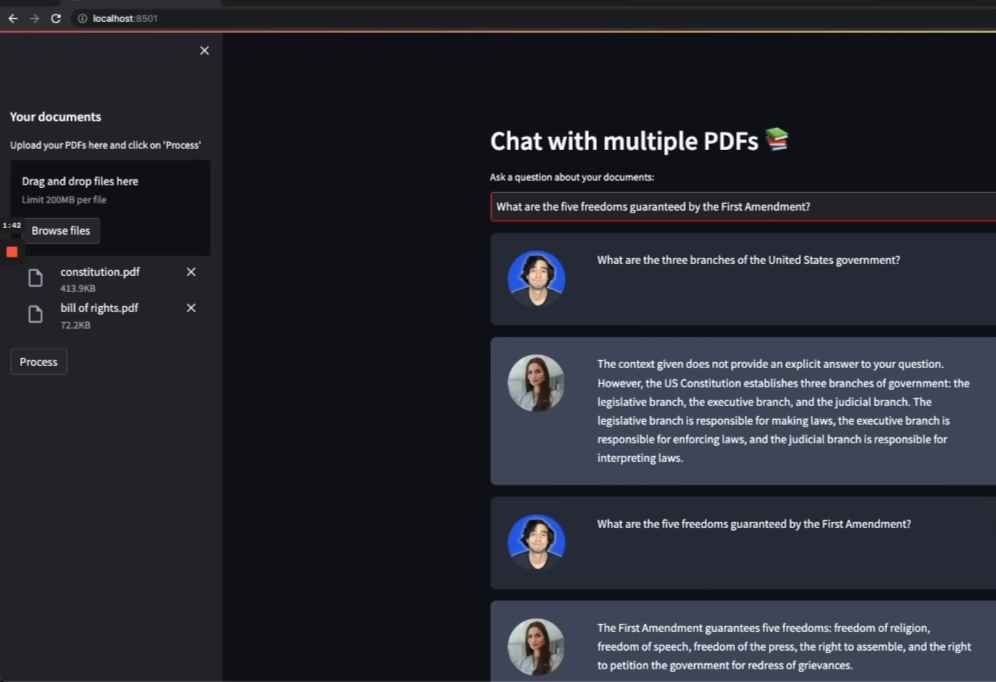

# 📚 Chat with Multiple PDFs using Gemini 💁

Effortlessly chat with your PDF files using **Google Gemini AI**! This project allows users to upload multiple PDFs, process them into a searchable format, and ask AI-powered questions based on the document content. 🚀

---

## 🔥 Features

- 📄 **Upload Multiple PDFs**: Drag and drop multiple PDF files for processing.
- 🧠 **AI-Powered Responses**: Uses **Gemini Pro** to generate answers from your document.
- 🗂️ **FAISS Vector Storage**: Efficient text chunking & similarity search for quick responses.
- 🔐 **Secure API Handling**: Uses `.env` file to store API keys securely.
- ⚡ **Streamlit UI**: Clean and simple web-based user interface.

---

## 🛠️ Tech Stack

- **Streamlit** → User-friendly interface 🖥️
- **PyPDF2** → Extracts text from PDFs 📄
- **LangChain** → Manages conversational flow & embeddings 🧩
- **Google Generative AI (Gemini Pro)** → AI-powered responses 🤖
- **FAISS** → Fast and efficient similarity search 🔍

---

## 📂 Project Structure

```
📦 Chat-with-PDFs-Gemini
├── app.py                # Main Streamlit app
├── requirements.txt      # Dependencies
├── .env                 # API keys (ignored in GitHub)
├── htmlTemplates.py      # Custom UI templates
└── faiss_index/         # FAISS storage (generated at runtime)
```

---

## 🚀 How to Run

### 1️⃣ Clone the Repository
```bash
git clone https://github.com/yourusername/Chat-with-PDFs-Gemini.git
cd Chat-with-PDFs-Gemini
```

### 2️⃣ Install Dependencies
```bash
pip install -r requirements.txt
```

### 3️⃣ Set Up API Key
Create a `.env` file and add your **Google Gemini API key**:
```bash
OPENAI_API_KEY=your_gemini_api_key
```

### 4️⃣ Run the App
```bash
streamlit run app.py
```

---

## 📝 How It Works

1. **Upload PDFs** 📂 → Drag and drop multiple PDF files.
2. **Process the Documents** 🔄 → Extracts text and creates embeddings.
3. **Ask AI Questions** 💬 → Type your query and get instant AI responses!

---

## 📸 Screenshots

### 🤖 AI Chat in Action


---

## 📌 Tips for Best Results

- Ensure PDFs contain **searchable text** (scanned images won't work well).
- Questions **outside the document's scope** may result in vague answers.
- Use **clear and specific queries** for better accuracy.

---

## 💡 Future Improvements

- ✅ Support for scanned PDFs using OCR 📸
- ✅ More AI models (GPT, Claude, etc.) 🔄
- ✅ Cloud-based FAISS storage for scalability ☁️

---

## 🤝 Contributing

Feel free to **fork** this project, open **issues**, and submit **pull requests**! Contributions are always welcome. 🌟

---

## 📜 License

This project is **MIT Licensed**. Free to use & modify. 🎉

---

Give this project a ⭐ if you found it useful! 🚀

